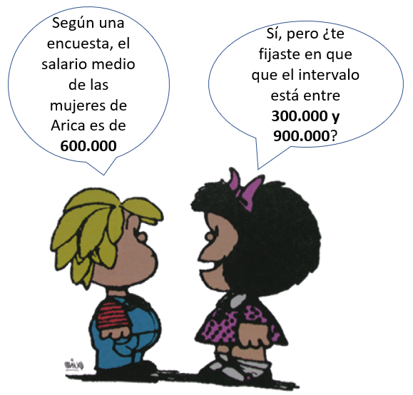
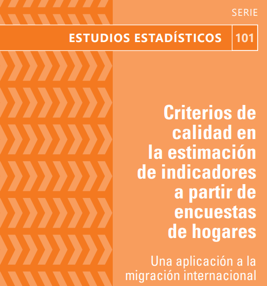

```{r setup, include=FALSE}
knitr::opts_chunk$set(warning = F)
hook_source <- knitr::knit_hooks$get('source')
```


# ¿Qué quiere decir calidad estadística?

Las medias (y cualquier otro estadístico) obtenidas de una muestra son estimaciones de un parámetro poblacional

--

```{r, warning=FALSE, message=FALSE, echo=FALSE, fig.align= "center", fig.height=4}
library(ggplot2)
library(tidyverse)
values <- rnorm(100000, mean = 0, sd = 1)
data <- data.frame(x = values)

ggplot(data, aes(x = x, fill = "coral")) +
  geom_density() +
  geom_vline(aes(xintercept = mean(x)), linetype = "dashed" ) +
  geom_vline(xintercept = 1.96, linetype = "dashed", color = "red" ) +
  geom_vline(xintercept = -1.96, linetype = "dashed", color = "red" ) +
  theme(legend.position = "none",
        axis.title = element_blank(),
        axis.text = element_text(size = 14) 
        )


```


---

# Pensemos en 2 distribuciones distintas

.pull-left[

```{r,  fig.align= "center", fig.height=4, echo=FALSE}
values1 <- rnorm(100000, mean = 0, sd = 10)
ci_1 <- c(mean(values1) - 1.96 * sd(values1), mean(values1) + 1.96 * sd(values1))

values2 <- rnorm(100000, mean = 0, sd = 4)
ci_2 <- c(mean(values2) - 1.96 * sd(values2), mean(values2) + 1.96 * sd(values2))


distributions <- bind_rows(bind_cols(values = values1, varianza = "alta varianza"),  bind_cols(values = values2, varianza = "baja varianza")) 

distributions %>%
  ggplot() + 
  geom_density(aes(x = values, fill = varianza), alpha=0.5) +
  labs(title = "Alta y baja varianza") +
  theme(plot.title = element_text(hjust = 0.5, size = 20),
        axis.title = element_blank(),
        legend.text = element_text(size = 12),
         axis.text = element_text(size = 14) 
        )


```
]
--

.pull-right[

```{r, fig.align= "center", echo=FALSE, fig.height=4 }
df <- data.frame(estimacion = c("alta varianza", "alta varianza", "baja varianza", "baja varianza"), valor = c(ci_1, ci_2))


ggplot(df, aes(x = as.factor(estimacion), y = valor)) +
  geom_point() +
  geom_segment(aes(x = estimacion , xend = estimacion, y = 0, yend = valor, colour = "segment")) +
  coord_flip() +
  geom_hline(yintercept = 0, linetype = "dashed") +
  labs(title = "Intervalos de confianza") +
  theme(legend.position = "none",
        axis.title = element_blank(),
        plot.title = element_text(hjust = 0.5, size = 20),
        axis.text = element_text(size = 14) 
        
        )

```
]

--

Intervalos de confianza demasiado amplios, no son informativos

--

Una estimación debe cumplir una cierta precisión (calidad) para que sea útil 

---

# Ejemplo de una estimación con baja precisión


.pull-left[


]

--

.pull-right[


]


---
# ¿Cómo medir la calidad de una estimación?

- Tamaño de muestra
- Tamaño de muestra efectivo
- Grados de libertad
- Error estándar
- Coeficiente de variación (y logarítmico)
- Conteo no ponderado
- Error relativo
 


---

# Estándares INE y CEPAL


.pull-left[

]


.pull-right[

]

<br>

--

.pull-left[
**¿Y qué hago con todo esto?**
]


.pull-right[

]


---

class: chapter-slide, middle, center


# Paquete calidad


---

# Mirada general

.center[

]

--

```{r, eval=F}
devtools::install_github("inesscc/calidad")
library(survey)
```

--

**2 familias de funciones:**
- create_
- evaluate_


---

#Seteo inicial


.center[

]


```{r, echo=F, warning=F, message=F}
library(tidyverse)
library(feather)
library(readxl)
library(survey)

casen <- read_feather("data/Casen 2017.feather")

casen <- casen %>% 
  mutate(fdt = if_else(activ %in% c(1, 2), 1, 0, missing = 0), # fuerza de trabajo
         ocupado = if_else(activ == 1, 1, 0, missing = 0), # persona ocupada
         desocupado = if_else(activ == 2, 1, 0, missing = 0), # persona desocupada
         metro = if_else(region == 13, 1, 0),
         num = if_else(row_number() <= 1, 1, 0),
         denom = 1) 


```


--


```{r,  warning=F, message=F }
library(survey)
library(calidad)
```


--

Declaramos el diseño complejo con la función `svydesign` de `survey`
```{r}
dc <- svydesign(weights = ~expr, ids = ~varunit, strata = ~varstrat, data = casen )

```

---

# Funciones disponibles

- `create_mean`: calcular la media (ingreso)
- `create_prop`: calcular proporción o razón (ocupación) 
- `create_total`: suma de variables continuas (ingreso) 
- `create_size`: conteo de unidades (ocupación)  
- `create_median`: calcular mediana (ingreso)

--

.center[
 **Los nombres están alineados con la teoría** 🤓
]


---

# Edad media por región: create_mean

```{r, eval=F}
create_mean(var = edad, dominios = sexo, disenio = dc)
```

```{r, echo=F}
create_mean(var = edad, dominios = sexo, disenio = dc) %>% 
  mutate_at(vars(mean, se, coef_var), ~round(., 3))
```

- grados de libertad
- tamaño de muestra
- coeficiente de variación

---

# Tasa de desempleo: create_prop 


```{r, eval=F}
create_prop(var = desocupado, dominios = sexo, disenio = dc)
```

--

Pero el desempleo se calcula sobre una subpoblación específica (fuerza de trabajo)

--

Para ello, utilizamos el argumento `subpop`

```{r, eval=F}
create_prop(var = desocupado, dominios = sexo, subpop = fdt, disenio = dc)
```

--

Es muy importante considerar que la variable **subpop debe ser dummy** 


---

# Conteo de desocupados por sexo: create_size


```{r, eval=F}
create_size(var = desocupado, dominios = sexo, subpop = fdt, disenio = dc)
```


.center[


```{r, echo=F}
create_size(var = desocupado, dominios = sexo, subpop = fdt, disenio = dc) %>% 
  mutate_at(vars(se, coef_var), ~round(., 3))

```


]


--

.red[Se requiere que la variable a estimar sea dummy]

```{r, error=T, eval=T}
create_size(var = region, dominios = sexo, subpop = fdt, disenio = dc)

```


---
class: chapter-slide, middle

# Evaluamos la calidad de nuestras estimaciones


---

# Calidad de la media de edad


```{r}
est <- create_mean(var = edad, dominios = sexo, disenio = dc)
tabla_html(evaluate_mean(est)) #<<

```

--

- `eval_n`: indica si el tamaño muestral es suficiente
- `eval_gl`: indica si los gl son suficientes
- `eval_cv`: indica el tramo en el que está el cv
- **`calidad`: evaluación final de la estimación** 


---

# Calidad de la tasa de desempleo

```{r}
est <-  create_prop(var = desocupado, dominios = sexo, subpop = fdt,  disenio = dc)
evaluate_prop(est) %>% 
  select(-c("cuadratica", "se", "eval_cv")) %>% 
  tabla_html() 

```

--

**Por defecto, las funciones usan el estándar de evaluación de calidad del INE**

---

# ¿Qué pasa si queremos considerar los criterios de CEPAL?


```{r}
est <- create_size(var = desocupado, dominios = region+sexo, subpop = fdt, disenio = dc, 
                   unweighted = T, deff = T, ess = T)      #<<             

evaluate_size(est, scheme = "cepal") %>% #<<
  select(region, sexo, total, n, gl, coef_var, unweighted, ess, tag) %>% 
  slice(1:4) %>% 
  tabla_html()
```


---

# ¿Y si necesito usar mis propios parámetros de calidad?


```{r}
evaluate_size(est, scheme = "cepal", unweighted = 200, ess = 180) %>% #<<
  select(region, sexo, total, n, gl, coef_var, unweighted, ess, tag) %>% 
  slice(1:4) %>% 
  tabla_html()

```


---

# Utilización de loops

Podemos generar un loop, agregando el parámetro `standard_eval = T`


```{r}

insumos <- data.frame()
for (var in c("edad", "esc")) {
  insumo <- create_mean(var = var, dominios = "sexo", disenio = dc,
                        standard_eval = T, rm.na = T )  
  insumos <- bind_rows(insumos, insumo)
}


```


---


# Desarrollo open source

En este [repositorio de github](https://github.com/inesscc/calidad) pueden proponer nuevos desarrollos

--

Pueden generar *issues* o nuevas ramas de desarrollo 

--

Si tienen propuestas de mejora o nuevos desarrollos, estaremos felices de revisarlo e incorporarlo al paquete  

.center[
### 😄😄😄😄😄
]


---

# Bonus track: shiny app


.center[

]


---

# Nuestros contactos ✉

- kilehmannm@ine.gob.cl
- rapizarros@ine.gob.cl
- ifaglonij@ine.gob.cl


---
class:  chapter-slide, middle


.center[
# Muchas gracias
]


